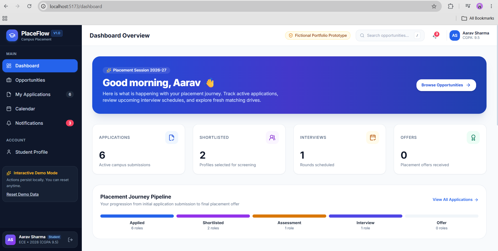
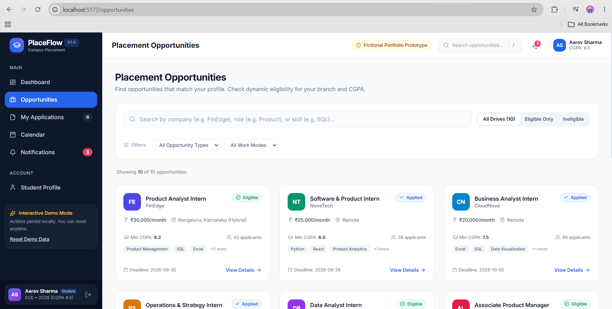
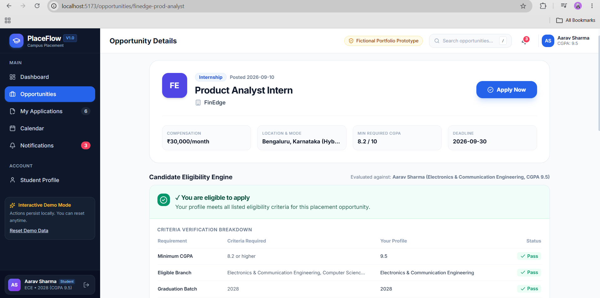
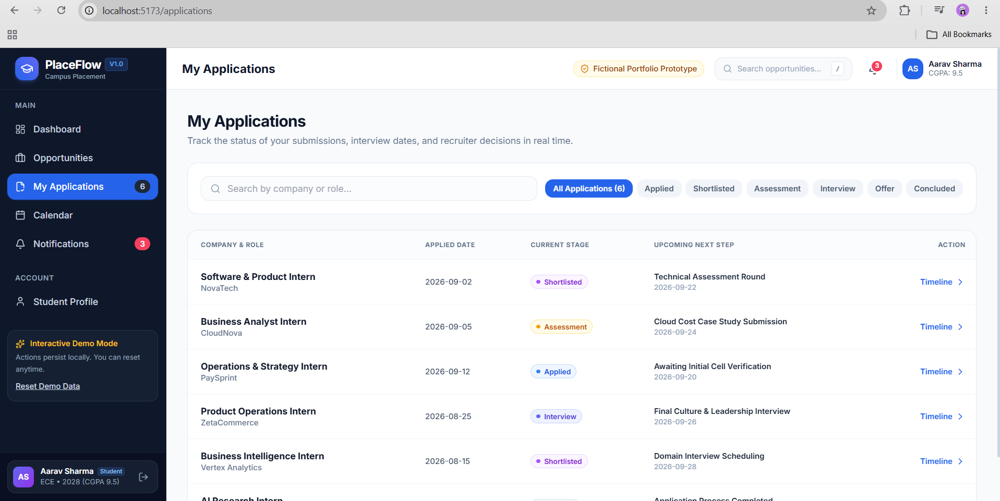
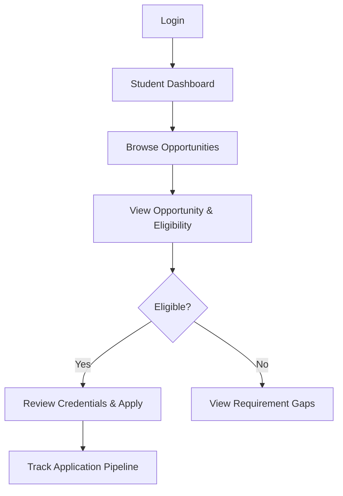

# PlaceFlow — Campus Placement Management System

> **Portfolio Project for Product Management + Project Management Internship Portfolio**
> **Phase 1: Student Placement Journey Prototype**

PlaceFlow is a centralized web application designed to simplify the campus placement journey for students.

It addresses common placement coordination problems such as scattered opportunity information, unclear eligibility criteria, missed deadlines, and limited visibility into application status.

---
## Product Preview
**Note:** PlaceFlow is a portfolio prototype using fictional student, company, and placement data. It is not connected to a real college placement system.

### Student Dashboard


### Placement Opportunities


### Eligibility Engine


### Application Tracking


## Problem Statement

Campus placement information is often fragmented across spreadsheets, WhatsApp groups, emails, and notice boards.

This creates several problems:

* **Missed Deadlines:** Students may lose track of application closing dates.
* **Ambiguous Eligibility:** Students have to manually interpret CGPA, branch, graduation year, and backlog requirements.
* **Limited Application Visibility:** Students may not know where their application stands in the recruitment process.
* **Manual Coordination:** Placement coordinators spend significant time answering status questions and managing placement information.

### Product Goal

Create a single student-facing platform that makes it easier to:

$$\text{Discover opportunities} \longrightarrow \text{Check eligibility} \longrightarrow \text{Apply} \longrightarrow \text{Track applications}$$

---

## Phase 1 — Student Placement Journey

The first phase focuses on the complete student-side placement experience.

### Core Demo Flow

1. **Login**
* Continue as a pre-configured demo student.
* Demo student: Aarav Sharma
* Branch: ECE
* Graduation Year: 2028
* Initial CGPA: 9.5
* Backlogs: 0


2. **Student Dashboard**
* View application overview.
* Track placement pipeline progress.
* View upcoming placement events.
* View recent notifications.


3. **Browse Opportunities**
* Search placement opportunities.
* Filter opportunities.
* View company, role, location, stipend, deadline, and eligibility information.


4. **Dynamic Eligibility Checking**
* Eligibility is evaluated using student credentials and opportunity requirements.
* Checks include:
* CGPA
* Branch
* Graduation year
* Backlogs
* Application deadline


5. **Application Flow**
* Eligible students can apply.
* Review candidate credentials before submission.
* Confirm application through a confirmation modal.
* Prevent duplicate applications.
* Display immediate submission feedback.


6. **Application Tracking**
* View submitted applications.
* Track recruitment stages:
* Applied
* Shortlisted
* Assessment
* Interview
* Offer
* Rejected


* Open an application timeline to view progress and next steps.


7. **Profile Management**
* Update student credentials.
* Eligibility is recalculated dynamically when profile information changes.


---

## Product Thinking Demonstrated

This project was designed with a product-oriented approach rather than only focusing on implementation.

### Key Product Decisions

* **Centralized placement discovery** to reduce information fragmentation.
* **Eligibility engine** to reduce confusion around placement criteria.
* **Application tracking** to improve visibility after applying.
* **Reusable eligibility logic** so different opportunities can use the same evaluation system.
* **Immediate feedback** after application submission to make the flow clear.
* **Dynamic eligibility recalculation** so changes to student credentials are reflected in opportunity eligibility.

### Product Success & KPI Framework

* **North Star Metric:** Application Completion Rate (Eligible Students $\rightarrow$ Confirmed Applications).
* **Product Efficiency:** Automated eligibility verification, eliminating manual criteria cross-checking.
* **User Engagement:** Frequency of dashboard visits per active placement drive week.

### Primary User

**Student:** A student looking for relevant placement opportunities, checking eligibility, applying, and tracking recruitment progress.

### Core User Journey



---

## Tech Stack

* **Frontend:** React 19, TypeScript
* **Routing:** React Router
* **Styling:** Tailwind CSS
* **Icons:** Lucide React
* **State Management:** React Context API
* **Persistence:** Browser localStorage
* **Build Tool:** Vite

---

## Application Routes

| Route | Purpose |
| --- | --- |
| `/login` | Demo student login |
| `/dashboard` | Student placement dashboard |
| `/opportunities` | Browse placement opportunities |
| `/opportunities/:id` | View opportunity and eligibility |
| `/applications` | Track submitted applications |
| `/calendar` | View placement events |
| `/notifications` | View notifications |
| `/profile` | Manage student profile |

---

## How to Run Locally

### Prerequisites

* Node.js 18+
* npm 9+

### Installation

Clone the repository:

```bash
git clone https://github.com/shreyarai-15/PlaceFlow.git
cd PlaceFlow

```

Install dependencies:

```bash
npm install

```

Start the development server:

```bash
npm run dev

```

Open the local URL shown in the terminal, typically:

```text
http://localhost:5173

```

### Production Build

```bash
npm run build

```

---

## Project Structure

```text
PlaceFlow/
├── public/
├── src/
│   ├── components/
│   ├── context/
│   ├── data/
│   ├── pages/
│   └── ...
├── .gitignore
├── package.json
├── README.md
├── tailwind.config.js
├── tsconfig.json
└── vite.config.ts

```

---

## Phase 1 Scope

Phase 1 intentionally focuses on the **student placement journey**.

The current prototype does not include:

* Real college/recruiter integrations
* Real authentication
* Email/SMS notifications
* Payment functionality
* Production backend infrastructure
* Real company placement data

The application uses fictional data and browser-based persistence for demonstration.

---

## Phase 2 Roadmap

Future phases can expand PlaceFlow into a multi-stakeholder placement management platform.

Planned areas include:

* **T&P Coordinator Portal**
* Student verification
* Shortlisting management
* Company drive scheduling


* **Recruiter Dashboard**
* Candidate pipeline management
* Test score management
* Interview scheduling


* **Project & Process Management**
* Placement drive task tracking
* Stakeholder management
* Risk and dependency tracking


* **Analytics & Placement Insights**
* Placement trends
* Hiring trends
* Application funnel analysis
* Placement package insights


---

## Project Status

**Phase 1 — Completed**

The current version demonstrates the complete student placement journey from opportunity discovery to application tracking.

**Next:** Phase 2 — Multi-stakeholder placement management.